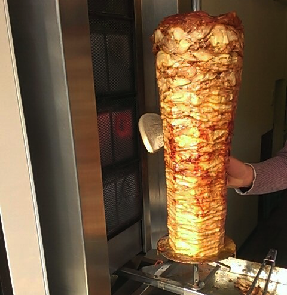

<<<<<<< HEAD

=======

>>>>>>> 9cce4e8858d64518d77497672c61a84ddb933dfd
# Kebab  

Kebab is a browser automation solution. It brings together the power of WebDriver, the robustness of Page Object modelling and the expressiveness of the Kotlin language.
not Groovy.

# Note

Experimental version

It cannot recommended to use in production now.

# Kebab VS Geb

The different point is Kebab is light weight.
Geb has wide range feature. But Kebab is simple feature,not exhaustive.

# How to contribute

## Build Environment

Kebab builds with Gradle. You do not need to have Gradle installed to work with the Kebab build as Gradle provides an executable wrapper that you use to drive the build.

On UNIX type environments this is gradlew and is gradlew.bat on Windows.

For example to run the Kebab test suite for the entire project you would run…

    ./gradlew test

# Licence

Apache License, Version 2.0
